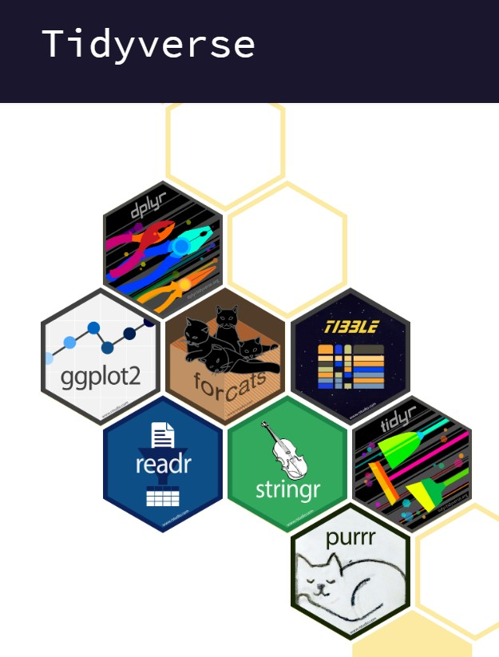
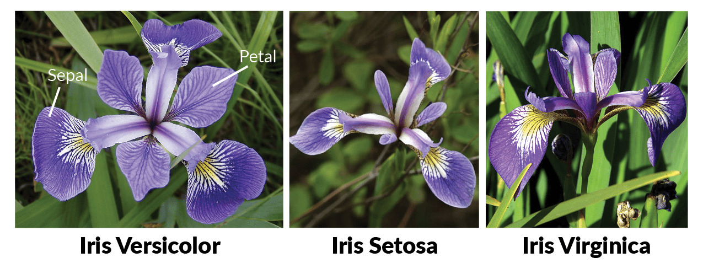

# **Tidyverse**

```{r tidyverse, echo=FALSE, fig.align="center"}

```

Tidyverse เป็น package ซึ่งนิพนธ์โดย Haley Wickham และคณะ โดย function ส่วนใหญ่ใน tidyverse นั้นเกี่ยวข้องกับการปรับแต่งข้อมูลจาก dataframe ซึ่งจะอำนวยความสะดวกให้เราสามารถทำงานได้มากขึ้นกว่าการใช้ base R ข้อเสียของ tidyverse นั้น อาจจะทำให้ run ช้ากว่า และมีปรับแต่งให้ตรงกับการใช้งานจำเพาะได้ยากกว่า แต่สำหรับผู้ที่ไม่ใช่ R hardcore นั้น tidyverse ถือว่าเป็น package ที่อำนวยความสะดวกได้อย่างดีเยี่ยม

โดย tidyverse นั้นจะเป็น package ใหญ่ และจะแบ่งเป็นหลาย package ย่อยๆ ได้อีก โดยเราสามารถเรียกใช้ ทั้งหมดได้ หรือ เรียกใช้แค่ package ย่อย

## dplyr

dplyr คือ package ย่อยของ tidyverse ซึ่งทำหน้าที่ในส่วน dataframe manipulation ทำให้เราสามารถดึงตารางออกมาได้อย่างอิสระ

การใช้งาน package ข้างนอกนั้นจะต้อง install ก่อน และเมื่อใช้งาน จะต้องใช้คำสั่ง library

```{r dplyr, message = FALSE}
# install.packages("tidyverse") รันคำสั่งนี้ก่อนถ้ายังไม่เคย install
library(dplyr) # ต้อง run ทุกครั้งที่จะใช้งาน
```

ในกรณีนี้จะใช้ข้อมูลตัวอย่าง iris เพื่อสาธิตการใช้ dplyr โดย iris เป็นข้อมูลของความยาวกลีบของพันธุ์ดอกไม้ต่างๆ

```{r iris, echo = FALSE}

```

รูปจาก: <https://www.datacamp.com/tutorial/machine-learning-in-r>

```{r load_iris}
df <- iris # โหลด dataframe ตัวอย่างที่ติดมากับ base R
head(df, 5)
```

function หลักๆ ของ dplyr จะเกี่ยวข้องกับ data manipulation เป็นส่วนใหญ่ ในที่นี้จะแนะนำที่จำเป็นต้องใช้ในบทอื่น

-   glimpse() มีไว้ดูภาพรวมข้อมูล

```{r glimpse}
glimpse(df)
```

-   select() เลือก column ที่ต้องการโดยใช้ตำแหน่งหรือชื่อ column ก็ได้

```{r select}
df %>% select(Species) %>% head(5) # เลือก column "Species"
df %>% select(2) %>% head(5) # เลือก column ที่ 2
df %>% select(1:2) %>% head(5) # เลือก 2 column
```

-   filter() กรองแถว (row) ที่ต้องการ โดยต้องระบุ ว่าต้องการข้อมูล ที่ column ไหน และต้องการกรองค่าที่เท่าไร

```{r filter}
# เลือกแถวที่ Species == virginica
df %>% filter(Species == "virginica") %>% head(5)

# เลือกแถวที่ Species = setosa, Sepal.Length = 5.4
df %>% 
  filter(Species == "setosa" & Sepal.Length == 5.4) %>% head(5)

# เลือกแถวที่ Sepal.Lenght = 5.1 หรือ 4.9
df %>% filter(Sepal.Length == 5.1 | Sepal.Length == 4.9) %>% head(10)
```

สังเกตว่าจะเห็นเครื่องหมาย `%>%` ซึ่งใน R เราจะเรียกว่า "pipe operator" เป็นสิ่งที่เป็นเอกลักษณ์ใน R ซึ่งส่งผลให้สามารถ run operation ได้ต่อๆ กัน เพื่อให้อ่านได้ง่าย

```{r pipe_operation}
# เลือกแถวที่ Species = setosa คอลัมน์ Sepal.Length
df %>% 
  filter(Species == "setosa") %>% 
  select(Sepal.Length) %>% head(5)

# เหมือนกับข้างบน แต่ไม่ใช้ pipe operator จะทำความเข้าใจได้ยากกว่า
select(filter(df, Species == "setosa"), Sepal.Length) %>% head(5)

# ใช้แค่ base R solution จะไม่สามารถดึงออกมาเป็น dataframe ได้
df[df["Species"] == "setosa", "Sepal.Length"]
```

บรรทัดสุดท้าย สำหรับ dataframe จะไม่สามารถดึงมาทั้ง column ได้ ซึ่งจะต้องใช้ข้อมูลอีกแบบ (tibble) แต่จะไม่พูดถึง ณ ที่นี่

**Note:** การ subset โดย dplyr นั้นสามารถทำใน dataframe/tibble เท่านั้น ไม่สามารถทำใน matrix ได้ (ต้องใช้วิธีของ base R)

-   ในส่วนการเรียงข้อมูลนั้นจะใช้ function arrange()

```{r arrange}
df %>% 
  arrange(Sepal.Length) %>% head(5) # เรียง Sepal.Length จากน้อยไปมาก

df %>% 
  arrange(desc(Sepal.Length)) %>% head(5) # เรียง Sepal.Length จากมากไปน้อย
```

-   เราสามารถจัดกลุ่มตัวแปรได้โดยใช้ group_by() โดยมักจะใช้คู่กับ summarize()

```{r summarize}
df %>% 
  group_by(Species) %>% #จัดกลุ่มตาม Species
  summarize(Sepal.Length = sum(Sepal.Length), Sepal.Width = sum(Sepal.Width)) #รวมความยาวทั้งหมด
```

## ggplot2

ggplot2 คือ package ย่อยอีกตัวของ tidyverse ซึ่งใช้สำหรับการ plot graph

### Anatomy of ggplot

```{r echo=TRUE, eval=FALSE}
ggplot(data = data, aes(x = x, y = y, col = col, fill = fill)) +
  geom_xxx() +
  theme_xxx() 
```

-   aes คือ aesthetic ซึ่งหมายถึงการ map ข้อมูลของเราเข้ากับตำแหน่งของกราฟ
    -   x = แกน x, y = แกน y

    -   col = สี, fill = สีพื้นหลัง
-   geom_xxx() คือ การกำหนดว่าเราต้องการที่จะ plot กราฟอะไร
    -   geom_point() = scatterplot

    -   geom_line() = lineplot

    -   geom_boxplot() = boxplot
-   theme_xxx() คือ การกำหนด theme ของกราฟ เช่น theme_bw(), theme_classic()
-   และยังมีการปรับแต่งอื่นๆ ได้อีกมาก สามารถศึกษาได้ที่ <https://ggplot2.tidyverse.org/reference/>

### Scatterplot

```{r scatterplot}
# install.packages("tidyverse") รันคำสั่งนี้ก่อนถ้ายังไม่เคย install
library(ggplot2) 

ggplot(df, aes(x = Sepal.Width, y = Sepal.Length, col = Species)) + geom_point()
```

### Barchart

ใช้สำหรับนับจำนวนของ column นั้น ไม่มีค่า y

```{r barplot}
ggplot(df, aes(x = Species, fill = Species)) + geom_bar() # fill ไว้สำหรับแบ่งสีใน barchart
```

ส่วน geom_col() จะรับค่า y ด้วย โดยข้อมูล x ที่ซ้ำกันจะถูกนำมารวมกัน (สามารถปรับแต่งได้เพิ่มเติม)

```{r colplot}
ggplot(df, aes(x = Species, y = Sepal.Width, fill = Species)) + # fill ไว้สำหรับแบ่งสีใน barchart
  geom_col() 
```

### Boxplot

ทำการสร้าง box plot

```{r boxplot}
ggplot(df, aes(x = Species, y = Sepal.Width, fill = Species)) + 
  geom_boxplot() 
```
